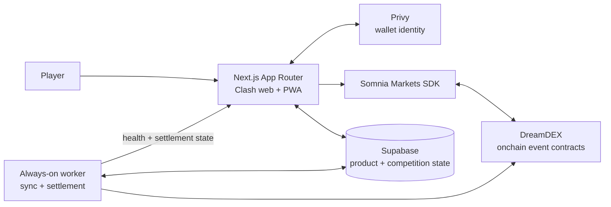

<div align="center">


# Clash Markets

### Draft the market. Captain your conviction. Clash for the table.

An onchain prediction-market arena where every decision becomes a pick, every pick becomes a squad, and every round becomes a competition.

<br />


</div>

<br />

> Clash Markets is a competitive interface for live prediction markets. It combines DreamDEX event contracts, squad-building, league competition, social identity, and settlement into one repeatable game loop.

## Contents

- [What is Clash Markets?](#what-is-clash-markets)
- [Why Clash Markets?](#why-clash-markets)
- [The problem with prediction markets today](#the-problem-with-prediction-markets-today)
- [How Clash solves it](#how-clash-solves-it)
- [What Clash Markets v0 covers](#what-clash-markets-v0-covers)
- [Architecture](#architecture)
- [Core: DreamDEX and event contracts](#core-dreamdex-and-event-contracts)
- [Data: how it works](#data-how-it-works)
- [How to use the app](#how-to-use-the-app)
- [Local development](#local-development)
- [Deployment](#deployment)
- [Coming features](#coming-features)
- [Next steps and goals](#next-steps-and-goals)
- [Contributing](#contributing)

## What is Clash Markets?

Clash Markets turns prediction-market participation into a structured competitive experience.

Instead of opening a market, placing an isolated trade, and leaving with a number in a portfolio, a player can:

1. Discover a live event contract.
2. Choose a direction and size a position.
3. Draft several positions into a squad.
4. Captain the conviction that matters most.
5. Compete in a league, clan, or public wall.
6. Return after settlement to see the result, score, and claimable value.

The product is designed around repeatable rounds, readable decisions, and visible consequences. Think Fantasy e-sport for the gamers but better.

## Why Clash Markets?

Prediction markets have strong information mechanics but weak participation loops. The underlying question may be interesting, yet the surrounding experience often feels like a terminal: a list of contracts, a chart, an order form, and a wallet balance.

Clash adds the missing layer of competition and identity:

| Traditional market experience | Clash Markets experience |
| --- | --- |
| Browse disconnected contracts | Draft a coherent squad |
| Trade as an isolated action | Make a visible, ranked decision |
| Portfolio balance as the only feedback | Scores, standings, streaks, and settlement cards |
| One generic experience for everyone | Leagues with different time horizons and moods |
| Liquidity and resolution hidden in infrastructure | Live market state surfaced in the decision flow |

The goal is not to obscure the market. It is to make the market legible, social, and worth returning to.

Why make just a single right prediction when you could make more?

## The problem with prediction markets today

Prediction markets still face a set of product problems:

- **High cognitive load.** Users must understand probability, price, outcome direction, expiry, and settlement before they can make a confident decision.
- **Low narrative continuity.** A position rarely feels connected to a larger round, strategy, or identity.
- **Weak social context.** Most products show prices and balances, but not why a decision matters relative to other participants.
- **Poor feedback loops.** A user may be correct without receiving a satisfying explanation of the result, the score, or what to do next.
- **Fragmented infrastructure.** Discovery, trading, identity, settlement, and rewards often live in separate surfaces.
- **Liquidity anxiety.** A market can look available until the user tries to fill an order. The live book needs to be part of the decision experience.

## How Clash solves it

Clash treats an event contract as the atomic competitive decision, then builds the game around it.

- Markets are grouped into readable league horizons: **Blitz**, **Classic**, and **Horizon**.
- A player drafts multiple markets into a squad instead of making one disconnected bet.
- One pick can be designated captain, creating a clear expression of conviction.
- Live book information and implied probability are shown before execution.
- Settlement is reconciled against the resolved onchain market state.
- Standings, clans, history, claims, and shareable cards make the outcome persistent.
- The app keeps the execution layer close to DreamDEX while keeping product state and competition state in Supabase.

Clash Markets now makes prediction fun and competitive.

## What Clash Markets v0 covers

The current v0 foundation includes:

- Privy wallet and identity authentication.
- Somnia network configuration for testnet and mainnet environments.
- DreamDEX market discovery and curation.
- Live binary-market data and order-book-aware trading.
- Squad Builder with multi-pick submissions and captain selection.
- Blitz, Classic, and Horizon league surfaces.
- League standings and scoring explanations.
- Positions, trade history, and settlement history.
- Clan creation, joining, registration, and standings.
- Live Wall activity surface.
- Edge Score and prediction streak surfaces.
- Claim and redemption flows for settled positions.
- Session-key management for approved trading and redemption actions.
- Admin and worker surfaces for market sync and settlement operations.
- Installable PWA metadata, branded icons, and production service-worker support.

v0 is intentionally focused on the core loop: **discover → draft → trade → compete → settle → return**.

## Architecture



### Application layer

The `src/app` tree uses the Next.js App Router. Route groups separate marketing, authenticated app, and admin surfaces without changing the public URL structure. The shared `AppShell` owns the navigation, mobile tab bar, wallet controls, notifications, balances, and global product chrome.

### Domain layer

Reusable product behavior lives under `src/lib` and `src/components`:

- `src/lib/dreamdex`: market discovery, classification, curation, opening prices, and SDK clients.
- `src/lib/squad-builder`: pricing, rounds, order construction, submission, and squad types.
- `src/lib/scoring`: pick settlement, solo-trade settlement, reconciliation, and sweep orchestration.
- `src/lib/session-keys`: policy and expiry rules for delegated actions.
- `src/lib/redemption`: claimable-position and redemption behavior.
- `src/lib/supabase`: browser, server, admin clients, and generated database types.

### Infrastructure layer

The web app is a Next.js deployment. The worker is a separate long-running Node process because market synchronization and settlement are continuous jobs, not short-lived request handlers.

## Core: DreamDEX and event contracts

DreamDEX is the market venue and onchain execution surface behind Clash. Clash does not invent a second market engine; it wraps the live market primitives in a more competitive product experience.

The integration uses the Somnia Markets SDK to:

1. List available binary markets.
2. Read the onchain market lifecycle and resolution state.
3. Fetch order-book tops and tradable market symbols.
4. Read opening prices used for display and scoring context.
5. Build and submit market orders.
6. Reconcile resolved outcomes before scoring picks and trades.

### Why event contracts matter

An event contract gives the product a precise object to reason about:

- a market question or underlying;
- a binary outcome direction;
- an opening or reference price;
- a live trading state;
- an expiry or resolution boundary;
- an onchain settlement result.

That precision lets Clash turn market participation into a fair round. A squad is not scored from a manually entered result or a UI-only value; it is reconciled against the market state that DreamDEX and Somnia expose.

### Market lifecycle

```text
discovered → validated → curated → tradable → expired → resolved / voided → settled
```

The sync layer checks cadence, lifecycle, onchain state, book information, and opening-price context before writing a market into the product cache. Resolved markets are synchronized separately so a market that disappears from the live feed can still be scored correctly.

## Data: how it works

Clash uses a split-source model: DreamDEX is authoritative for market and execution state, while Supabase stores the product state needed to make a competitive application.

| Data | Source of truth | Role in Clash |
| --- | --- | --- |
| Market lifecycle and resolution | Somnia / DreamDEX | Determines whether a market is tradable, resolved, or voided |
| Order-book and opening-price context | DreamDEX SDK and indexer | Drives display, pricing, and execution checks |
| Users and profiles | Supabase | Product identity and player state |
| Squads and picks | Supabase + onchain execution references | Stores the composition of a player’s round |
| Leagues, clans, standings | Supabase | Organizes competition and rankings |
| Settlement records and claims | Supabase reconciled with onchain state | Makes outcomes visible and redeemable |
| Worker health | Supabase | Gives operators a durable view of background jobs |

### Read path

```text
Browser → Next.js route / server client → Supabase cache
                                      ↘ DreamDEX / Somnia for live execution data
```

### Write and settlement path

```text
Player action
  → validate session and policy
  → read fresh market state
  → build order / squad submission
  → execute against DreamDEX
  → persist product references in Supabase
  → worker observes resolution
  → reconcile and score
  → expose claims, history, and standings
```

This separation is important: product pages remain fast and queryable, while the execution and resolution layers remain tied to the venue and chain.

## How to use the app

### 1. Connect

Open the app and connect with Privy. Clash can use wallet-based identity while keeping the experience approachable for users who do not want to manage every transaction manually.

### 2. Choose a league

Pick the time horizon that matches your style:

- **Blitz**: fast decisions and short market windows.
- **Classic**: the everyday competitive board.
- **Horizon**: longer-range conviction.

### 3. Draft your squad

Select live markets, choose an outcome direction, review the implied probability and available book, set your stake, and choose a captain when the squad is ready.

### 4. Submit and compete

Submit the squad through the trading flow. The app checks that the selected markets are still live and that the order can fill against current liquidity.

### 5. Follow the round

Use Positions, History, the Live Wall, league standings, and clan views to follow how your decisions compare with the field.

### 6. Settle and claim

After the underlying event contracts resolve, Clash reconciles the result, scores the relevant picks, updates standings, and surfaces claimable value where applicable.

## Local development

### Requirements

- Node.js `22.13+`
- pnpm `11+`
- A Supabase project
- Privy configuration
- DreamDEX / Somnia Markets configuration

### Setup

```bash
pnpm install
```

Create a local environment file from the example:

```bash
Copy-Item .env.example .env.local
```

Fill in the required values for the selected network. Never commit `.env`, `.env.local`, private keys, service-role keys, or secrets.

Start the web app:

```bash
pnpm dev
```

Start the background worker in a second terminal when testing sync and settlement behavior:

```bash
pnpm worker
```

Useful checks:

```bash
pnpm typecheck
pnpm build
```

## Deployment

### Vercel: web application

The repository includes `vercel.json` with the pnpm install and build commands. Import the repository into Vercel and add the environment variables from `.env.example` in the project settings.

Set `NEXT_PUBLIC_APP_URL` to the deployed origin so canonical and social metadata resolve to the production URL.

Vercel is the natural home for the Next.js web surface and route handlers. It is not the right runtime for the always-on settlement loop.

### Render: web application

The repository includes `render.yaml` for the web service. Render should use:

```text
Build: pnpm install --frozen-lockfile && pnpm build
Start: pnpm start
Health check: /
```

Add the environment values in the Render dashboard or Blueprint flow. Keep secrets server-side and use separate values for testnet and mainnet.

### Render: worker web service

The worker is configured as a separate Render **Web Service** in `render.yaml`. It exposes `GET /health` and binds to `0.0.0.0:$PORT`, satisfying Render's web-service requirements while keeping the sync and settlement loop continuously running.

```text
Build: pnpm install --frozen-lockfile
Start: pnpm worker
```

The worker should be continuously running. It is responsible for market synchronization, settlement sweeps, solo-trade settlement, and worker-health reporting.

### Supabase

The application expects the Supabase schema and policies to be provisioned outside the web deployment lifecycle. The local Supabase metadata directory is ignored by Git, and `supabase/migrations/` is intentionally excluded from this repository’s Git history.

## Coming features

The product direction is focused on depth around the core loop:

- richer matchday and round recaps;
- more expressive player and clan profiles;
- improved social sharing for settled squads and daily winners;
- deeper Edge Score explanations and player analytics;
- stronger notification and alert flows;
- broader league formats and competitive modes;
- better market discovery and curation controls;
- more polished delegated trading and redemption experiences;
- production-grade observability for sync, liquidity, and settlement health.

## Next steps and goals

### Near term

- Make every market state understandable before a user commits.
- Reduce time from first visit to first confident squad.
- Make settlement feel like an event, not a silent database update.
- Improve resilience around thin liquidity, stale books, and transient indexer failures.

### Medium term

- Grow clans into durable communities with recurring competition.
- Introduce richer historical data and player performance narratives.
- Give league creators more control over rules, scoring, and schedules.
- Expand the number of market cadences the product can curate responsibly.

### Long term

Clash should become the competitive social layer for onchain event contracts: a place where market skill is visible, repeatable, and worth developing over time.

## Repository map

```text
src/
├── app/                    Next.js routes, API handlers, and route groups
├── components/             Product UI and interaction surfaces
└── lib/                    DreamDEX, scoring, squads, auth, chains, and data access
public/
├── assets/                 PWA icons and Clash branding
└── sw.js                   Production service worker
supabase/                   Local Supabase project metadata
worker/                     Long-running market sync and settlement process
render.yaml                Render web-service blueprint
vercel.json                Vercel build configuration
```

## Contributing

Clash Markets is being built around a simple principle: market infrastructure should make better decisions possible, not make the product harder to understand.

When contributing, keep changes aligned with that principle:

- preserve the distinction between onchain truth and product cache;
- do not hide execution or settlement assumptions;
- keep user-facing market states explicit;
- test settlement and failure paths, not only the happy path;
- avoid committing credentials or generated local database state.

## License

See [LICENSE](LICENSE).

<div align="center">

<br />

**Clash Markets: make your conviction count.**

</div>
